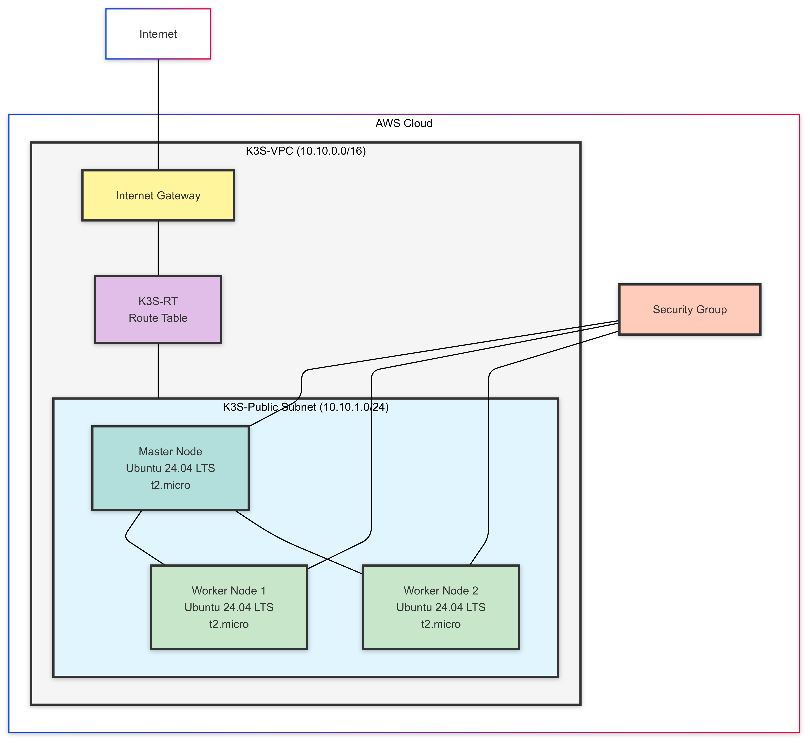

# K3s AWS Infrastructure 🚀

[](https://github.com/TheToriqul/K3s-AWS-Infra)
[](https://github.com/TheToriqul/K3s-AWS-Infra/stargazers)

## 📋 Description
A production-grade infrastructure setup for deploying lightweight Kubernetes clusters on AWS using K3s. This project provides an automated approach to creating a robust, scalable Kubernetes environment while maintaining cost-effectiveness through AWS free tier resources.

## 🏗️ Project Architecture
<figure>
    <p align="center">
        
        <p align="center">K3s AWS Infrastructure Architecture</p> 
    </p>
</figure>

## 🛠️ Technologies Used
- 
- 
- 
- 
- 

## ⭐ Key Features
- Single-master, multi-worker Kubernetes cluster architecture
- Custom VPC with public subnet configuration
- Automated node joining process
- Free tier eligible infrastructure
- Secure network configuration with custom security groups

## 📥 Installation

<details>
<summary>View Installation Details</summary>

### Prerequisites
- AWS Account with appropriate permissions
- AWS CLI installed and configured
- Basic knowledge of Kubernetes and AWS

### Step-by-Step Setup

1. VPC Setup
```bash
# Create VPC
VPC Name: K3S-VPC
IPv4 CIDR: 10.10.0.0/16
```

2. Subnet Configuration
```bash
# Create public subnet
Name: K3S-Public
IPv4 CIDR: 10.10.1.0/24
Availability Zone: ap-southeast-1a
```

3. Launch EC2 Instances
```bash
# Launch instances with:
AMI: Ubuntu Server 24.04 LTS
Instance Type: t2.micro
VPC: K3S-VPC
```
</details>

## 🚀 Usage

<details>
<summary>View Usage Details</summary>

### Master Node Setup
```bash
# Install K3s on master
curl -sfL https://get.k3s.io | sh -

# Get node token
sudo cat /var/lib/rancher/k3s/server/node-token
```

### Worker Node Setup
```bash
# Join worker nodes
curl -sfL https://get.k3s.io | K3S_URL=https://<MASTER_IP>:6443 K3S_TOKEN=<NODE_TOKEN> sh -
```

### Verify Cluster
```bash
# Check node status
kubectl get nodes
```
</details>

## ⚙️ Configuration

<details>
<summary>View Configuration Details</summary>

### Security Group Configuration
Allow inbound traffic:
- SSH (22)
- Kubernetes API (6443)
- Node communication (8472)
- HTTP/HTTPS (80/443)

### Network Configuration
- VPC CIDR: 10.10.0.0/16
- Subnet CIDR: 10.10.1.0/24
- Route table with internet gateway
</details>

## 🔧 Troubleshooting

<details>
<summary>View Troubleshooting Guide</summary>

### Common Issues
1. **Cannot connect to master node**
   - Verify security group rules
   - Check if master node is running
   - Ensure correct IP address is used

2. **Worker node not joining**
   - Verify node token is correct
   - Check network connectivity
   - Validate security group settings

### Logs to Check
```bash
# Check K3s logs
sudo journalctl -u k3s

# Check K3s agent logs
sudo journalctl -u k3s-agent
```
</details>

## 📚 Learning Objectives
- Understanding Kubernetes cluster architecture
- AWS networking and security concepts
- Infrastructure as Code principles
- High availability and scalability patterns
- DevOps best practices

## 🎓 How I Use This Repository
1. Clone and explore the configuration
```bash
git clone https://github.com/TheToriqul/K3s-AWS-Infra.git
cd K3s-AWS-Infra
```

2. Clean up resources
```bash
# Terminate instances
aws ec2 terminate-instances --instance-ids <instance-id>

# Delete VPC resources
aws ec2 delete-vpc --vpc-id <vpc-id>
```

## 📝 Notes
- Make sure to replace `<MASTER_IP>` with your actual master node IP address
- Replace `<NODE_TOKEN>` with the token obtained from the master node
- Ensure all security group rules are properly configured before proceeding
- Keep the node token secure and do not share it publicly

## 🔮 Further Learning

- Implement Infrastructure as Code using Terraform
- Add monitoring with Prometheus and Grafana
- Implement CI/CD pipelines
- Explore K3s high availability setup
- Add automated backup solutions

## 📚 Resources
- [Poridhi](https://poridhi.io/)
- [K3s Documentation](https://docs.k3s.io/)
- [AWS Documentation](https://docs.aws.amazon.com/)
- [Kubernetes Documentation](https://kubernetes.io/docs/home/)
- [DevOps Best Practices](https://aws.amazon.com/devops/best-practices/)

## 🤝 Contributing
1. Fork the repository
2. Create a feature branch
3. Commit your changes
4. Push to the branch
5. Open a pull request

## 📫 Contact
For any questions or inquiries:
- 📧 Email: toriqul.int@gmail.com
- 📱 Phone: +65 8936 7705, +8801765 939006

## 🔗 Project Links
- [GitHub Repository](https://github.com/TheToriqul/K3s-AWS-Infra)
- [Issue Tracker](https://github.com/TheToriqul/K3s-AWS-Infra/issues)

## 🙏 Acknowledgments
- Poridhi lab team
- K3s development team
- AWS documentation team
- Open source community

---

Feel free to explore, modify, and build upon this configuration as part of my learning journey. You're also welcome to learn from it, and I wish you the best of luck!